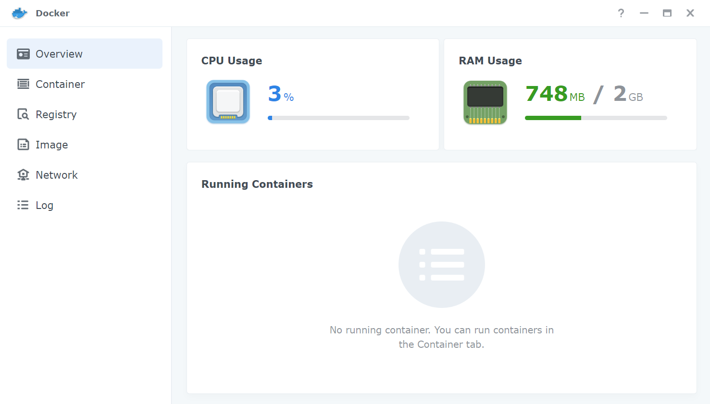
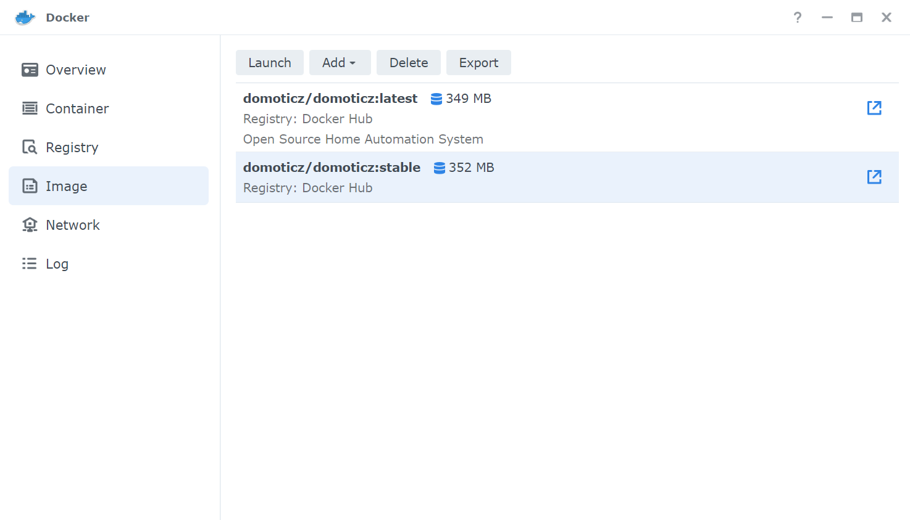
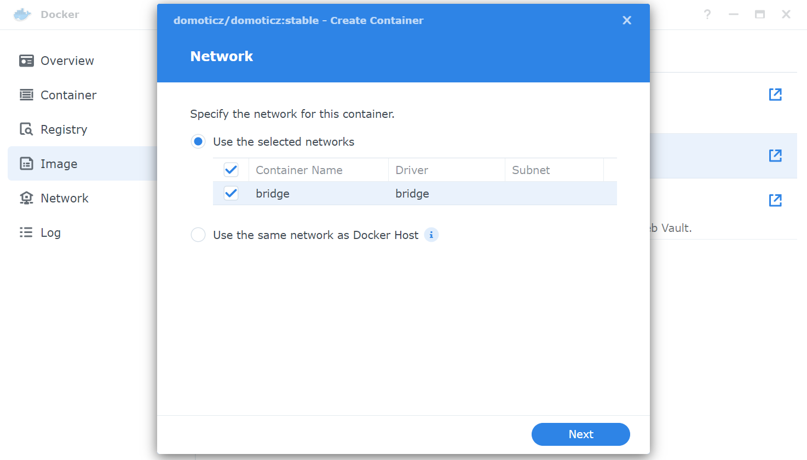
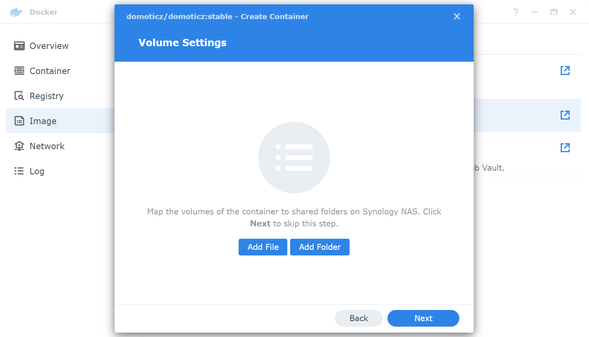
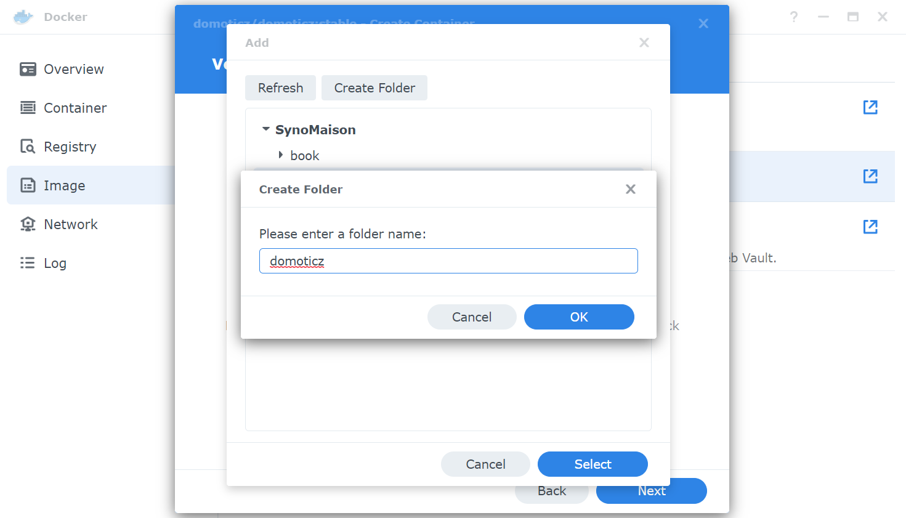
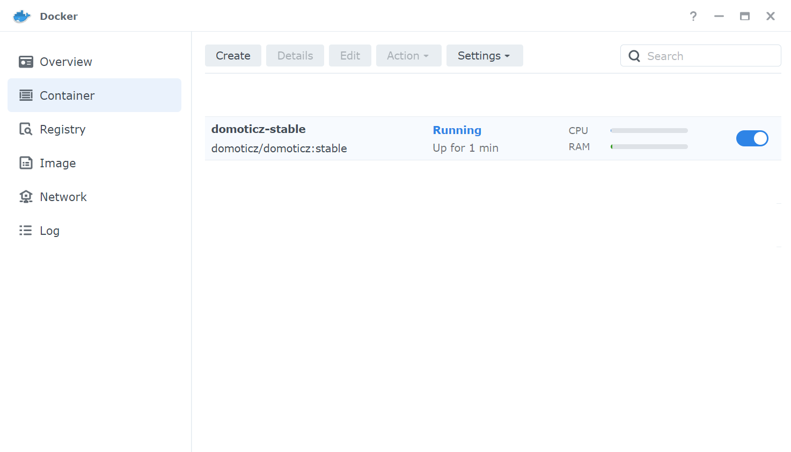

DRAFT


# Tutorial - Installation with Docker on Synology (DSM 7.x)

This tutorial explains how to install Domoticz with the embedded Docker application on a Synology NAS.

These are the first steps before [Installing the plugin on Synology](Plugin_Installation.md#3---installation-running-on-synology-nas)
* 1 - [DomoticZ installation](#DomoticZ-installation)
* 2 - [USB drivers installation](#USB-drivers-installation)

# Foreword
You first need the docker application installed (Application center)

If it's a migration from another system, first do a [backup](Plugin_Backup.md).


# DomoticZ installation

Lanch Docker, you should have the Overview.
Select Registry :



Look for DomoticZ in the search bar (top right):


Double click on the official image (domoticz/domoticz) and choose for which version you need. Stable or beta allows to be on the last corresponding version.


Next, wait for the download and go in Image:



Double click on the DomoticZ image. A new window open with the necessary parameters for the container creation. First step, network interface, select the default one:


Choose a name and check "Execute container using high privilege" and "Enable auto-restart", then validate with "Next".


You need to choose port numbers and modify the 'Auto' by the wanted one, the auto option will generate new port numbers at restart and you'll need to open docker to take notice.
The SSL port 443 is currently used by DSM, you need to choose another one (or let Auto if you don't plan to use it):


This part is quite important as it allows to keep outside docker the userdatas (database, plugins, scripts...) and gain access with DSM interface (file station). You need to select "Add Folder":



Select docker then "Crate folder" and name it domotciz.



Once the folder has been created, you must indicate the access path: `/opt/domoticz/userdata`


And that's it, the configuration is done, apply and do next.
The last screen offers a summary before the container is created:


Go to the Container tab, our new container is created:



Double click on it to access the details:


DomoticZ is now operational and you can access it.
A plugins folder is now created in the directory __docker/domoticz__.


You can continue the installation of the Plugin by following:  [Installing the plugin on Synology](Plugin_Installation.md#3---installation-running-on-synology-nas)


# USB drivers installation
En fonction du modèle de coordinateur, le ou les drivers USB ne sont pas les mêmes :
* Pour la première version de la zigate, le dongle Elelabs, la clé SonOff version P, il faut le driver __cp210x.ko__, on le trouve sur le [github](https://github.com/robertklep/dsm7-usb-serial-drivers). Pour choisir le bon fichier, il faut connaitre le nom du type de CPU sur le site de [Synology](https://kb.synology.com/fr-fr/DSM/tutorial/What_kind_of_CPU_does_my_NAS_have).
* Pour la zigate v2 ou la conbee, il faut le fichier __ftdi_sio.ko__. A partir de DSM7.0, celui-ci est déjà présent.
* Pour la conbee 2 ou la SonOff version E à base de chipset Silabs, il faut également charger __cdc-acm.ko__, également présent.
* Pour la Zzh d'Electrolama, il faut le driver __ch341.ko__ disponible sur le [github](https://github.com/robertklep/dsm7-usb-serial-drivers) de la même manière que pour le driver cp210x.ko.

## Chargement automatique
Cette solution utilise le planificateur de tâches (panneau de configuration) en créant une tâche déclenchée.
Cette tâche sera chargée de copier les drivers dans le repertoire /lib/modules car à chaque mise à jour de DSM, les drivers sont supprimés.
Ensuite, intervient le chargement des drivers dans le noyau.


J'ai choisi de mettre les fichiers à la racine de mon home, remplacer les xxx par votre répertoire et ne chargez que le nécessaire :

```
cd /var/services/homes/xxx
cp *.ko /lib/modules/
insmod /lib/modules/usbserial.ko > /dev/null 2>&1
insmod /lib/modules/cp210x.ko > /dev/null 2>&1
insmod /lib/modules/ftdi_sio.ko > /dev/null 2>&1
insmod /lib/modules/cdc-acm.ko > /dev/null 2>&1
insmod /lib/modules/ch341.ko > /dev/null 2>&1
```


Il ne reste plus qu'à redémarrer DSM.


## Chargement manuel (utilisateur avancé)
Pour charger les drivers, connectez-vous en ssh au NAS et éxécuter les commandes suivantes, en utilisant la commande avec le fichier correspondant à votre modèle de clé après avoir copié les drivers :

```
cp *.ko /lib/modules/

sudo insmod /lib/modules/usbserial.ko

sudo insmod /lib/modules/cp210x.ko
OR
sudo insmod /lib/modules/ftdi_sio.ko
OR/AND
sudo insmod /lib/modules/cdc-acm.ko
OR
sudo insmod /lib/modules/ch341.ko
````

Pour que les drivers soient chargés au démarage du NAS, vous pouvez :


* Soit ajouter un fichier start-usb-drivers.sh dans le répertoire /usr/local/etc/rc.d/start-usb-drivers.sh

Supprimer la ligne dont vous n'avez pas besoin (cp210x.ko ou ftdi_sio.ko).

```
#!/bin/sh
case $1 in
  start)
    insmod /lib/modules/usbserial.ko > /dev/null 2>&1
    insmod /lib/modules/cp210x.ko > /dev/null 2>&1
    insmod /lib/modules/ftdi_sio.ko > /dev/null 2>&1
    insmod /lib/modules/cdc-acm.ko > /dev/null 2>&1
    insmod /lib/modules/ch341.ko > /dev/null 2>&1
    ;;
  stop)
    exit 0
    ;;
  *)
    exit 1
    ;;
esac
```

et de le rendre exécutable :
```
chmod +x /usr/local/etc/rc.d/start-usb-drivers.sh
```
