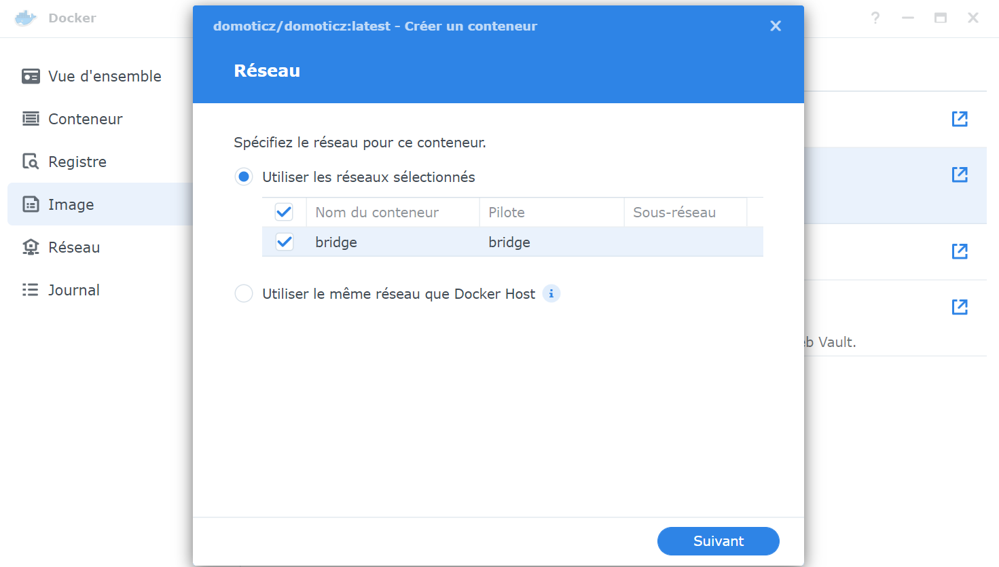
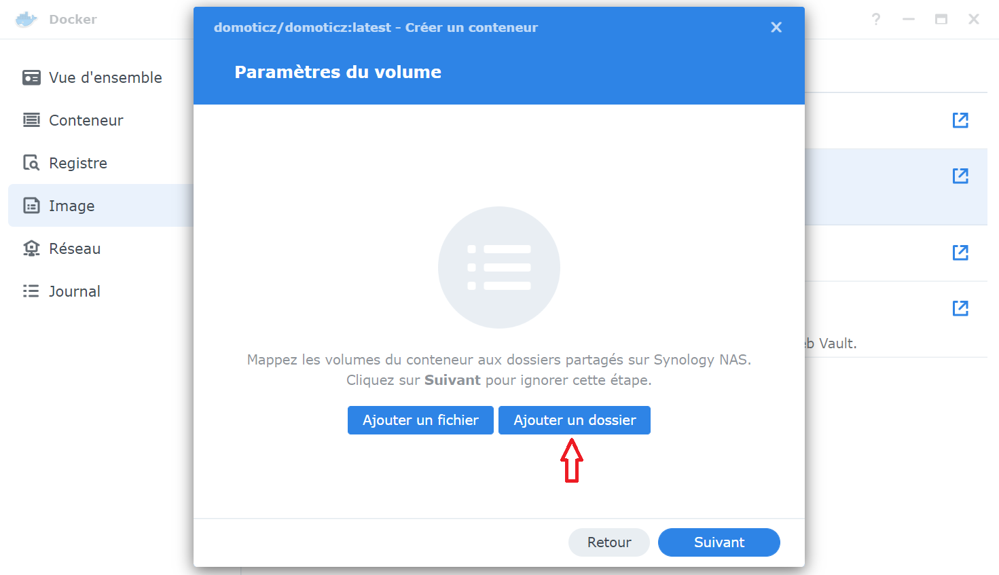
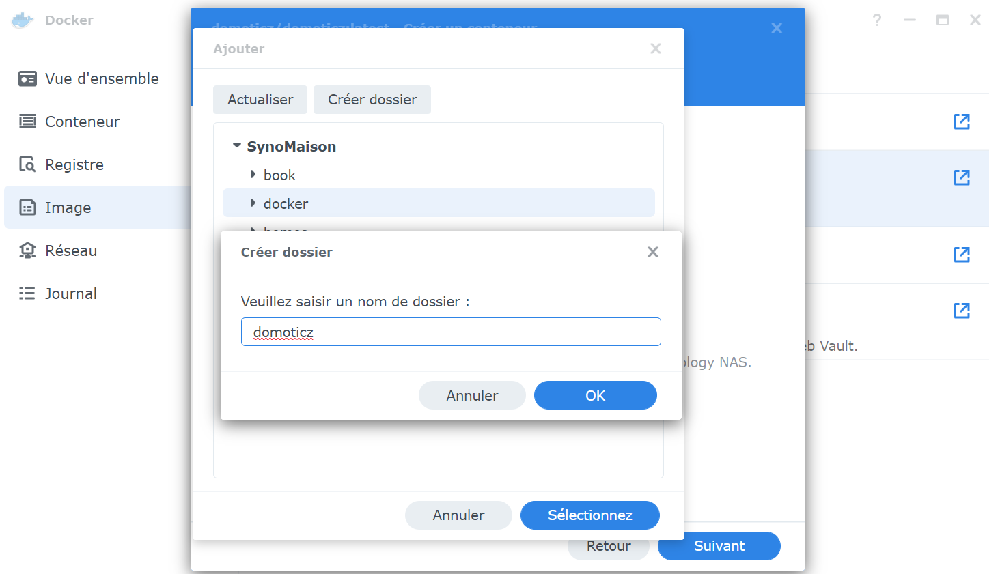
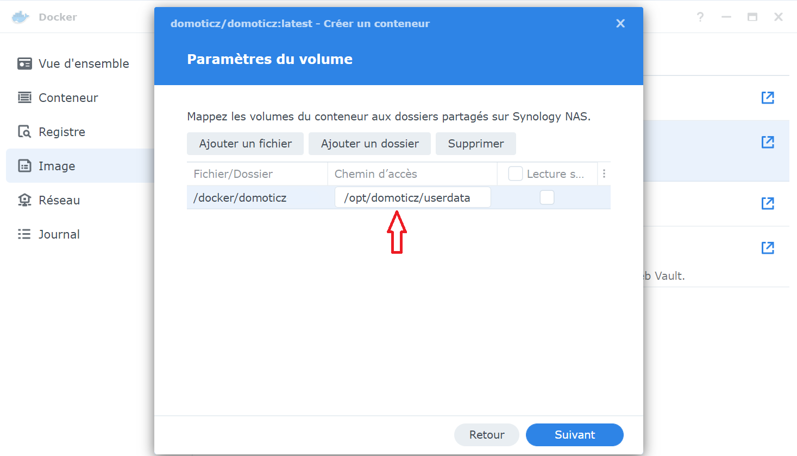
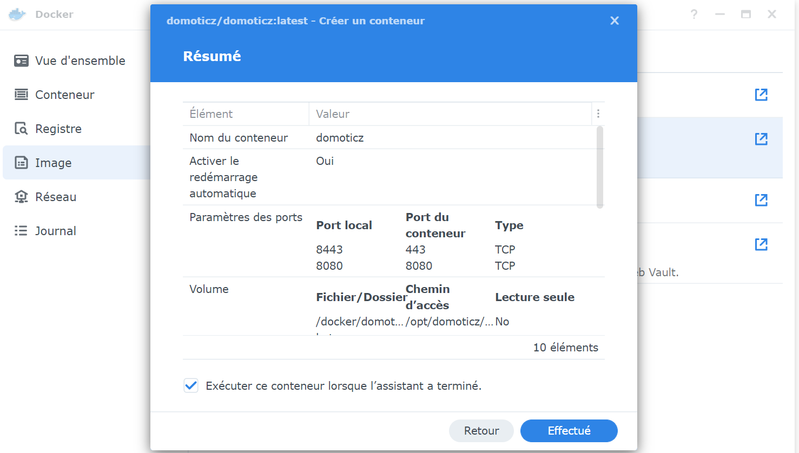
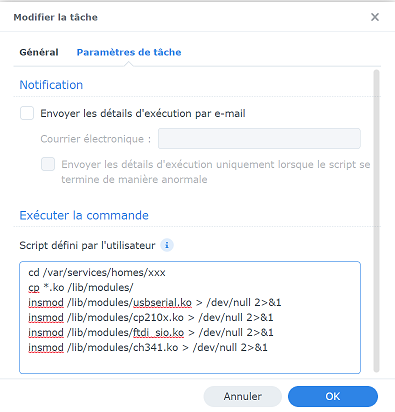

# Tutoriel - Installation sur Synology avec Docker 

Ce tutoriel explique comment installer DomoticZ et le Plugin avec Docker sur un NAS Synology.

C'est un pré-requis à l'installation du Plugin sous Docker [Installation sur Docker dans un NAS Synology](Plugin_Installation.md#4---installation-sur-nas-synology-avec-docker)

# Avant propos
Ce tutoriel suppose que Docker est déjà installé sur votre NAS (Centre de paquets)

S'il s'agit d'une migration, vous devez :

* Sur la page Paramètre, Sauvegarde / restauration, Sauvegarder la base de données
* Copier et sauvegarder le contenu du dossier Data/ du Plugin


# Installation de DomoticZ

Lancer Docker, vous arrivez sur la Vue d'ensemble.
Cliquer sur Registre :


Cherchez DomoticZ dans la barre en haut à droite :


Double cliquez sur l'image souhaité. Je choisis l'officiel, domoticz/domoticz. Il faut choisir sur quelle branche du projet on souhaite être : stable ou beta.


Ensuite, aller dans Image:


Double cliquer sur l'image DomoticZ. Nous arrivons dans les paramètres nécessaires à la création du Conteneur. En premier lieu, nous choisissons l'interface réseau, dans mon cas, bridge.


Choisir un nom et cocher "Exécuter le conteneur à l'aide de privilèges élevés", ainsi que "Activer le redémarrage automatique", puis valider "Suivant".


Ensuite, choisir l'onglet Ports et modifier les 'Auto' par des ports fixes.
Le port SSL 443 étant déjà utilisé par le NAS, il faut en choisir un autre :


Cette partie est très importante pour le Plugin car elle va permette d'avoir accès aux plugins via File Station.
Il faut cliquer sur "Ajouter un dossier".



Sélectionner docker puis "Créer dossier" et le nommer domoticz.



Une fois le dossier créé, il faut indiquer le chemin d'accès : `/opt/domoticz/userdata`



Et voilà, la configuration est faite, appliquer et faire suivant.
Le dernier écran propose un résumé avant la création du Conteneur :



Aller dans l'onglet Conteneur, notre nouveau Conteneur est créé:


Double cliquer dessus pour accéder aux détails :


DomoticZ est maintenant opérationnel et vous pouvez y accéder.
Un dossier plugins est maintenant créé dans le répertoire __docker/domoticz__.


Vous pouvez continuer l'installation du Plugin en suivant : [Installation sur Docker dans un NAS Synology](Plugin_Installation.md#4---installation-sur-nas-synology-avec-docker)

# Installation des drivers USB
En fonction du modèle de coordinateur, le ou les drivers USB ne sont pas les mêmes :
* Pour la première version de la zigate ou le dongle Elelabs, il faut le driver __cp210x.ko__, on le trouve sur le [github](https://github.com/robertklep/dsm7-usb-serial-drivers). Pour choisir le bon fichier, il faut connaitre le nom du type de CPU sur le site de [Synology](https://kb.synology.com/fr-fr/DSM/tutorial/What_kind_of_CPU_does_my_NAS_have).
* Pour la zigate v2, les clés à base de chipset TI (Zzh, SonOff version P...) ou la conbee, il faut le fichier __ftdi_sio.ko__. A partir de DSM7.0, celui-ci est déjà présent.
* Pour la conbee 2, il faut également charger __cdc-acm.ko__, également présent.
* Pour la SonOff version E à base de chipset Silabs, il faut le driver __ch341.ko__ disponible sur le [github](https://github.com/robertklep/dsm7-usb-serial-drivers) de la même manière que pour le driver cp210x.ko.

## Chargement automatique
Cette solution utilise le planificateur de tâches (panneau de configuration) en créant une tâche déclenchée.
Cette tâche sera chargée de copier les drivers dans le repertoire /lib/modules car à chaque mise à jour de DSM, les drivers sont supprimés.
Ensuite, intervient le chargement des drivers dans le noyau.


J'ai choisi de mettre les fichiers à la racine de mon home, remplacer les xxx par votre répertoire et ne chargez que le nécessaire :

```
cd /var/services/homes/xxx
cp *.ko /lib/modules/
insmod /lib/modules/usbserial.ko > /dev/null 2>&1
insmod /lib/modules/cp210x.ko > /dev/null 2>&1
insmod /lib/modules/ftdi_sio.ko > /dev/null 2>&1
insmod /lib/modules/cdc-acm.ko > /dev/null 2>&1
insmod /lib/modules/ch341.ko > /dev/null 2>&1
```



Il ne reste plus qu'à redémarrer DSM.


## Chargement manuel (utilisateur avancé)
Pour charger les drivers, connectez-vous en ssh au NAS et éxécuter les commandes suivantes, en utilisant la commande avec le fichier correspondant à votre modèle de clé après avoir copié les drivers :

```
cp *.ko /lib/modules/

sudo insmod /lib/modules/usbserial.ko

sudo insmod /lib/modules/cp210x.ko
OR
sudo insmod /lib/modules/ftdi_sio.ko
OR/AND
sudo insmod /lib/modules/cdc-acm.ko
OR
sudo insmod /lib/modules/ch341.ko
````

Pour que les drivers soient chargés au démarage du NAS, vous pouvez :


* Soit ajouter un fichier start-usb-drivers.sh dans le répertoire /usr/local/etc/rc.d/start-usb-drivers.sh

Supprimer la ligne dont vous n'avez pas besoin (cp210x.ko ou ftdi_sio.ko).

```
#!/bin/sh
case $1 in
  start)
    insmod /lib/modules/usbserial.ko > /dev/null 2>&1
    insmod /lib/modules/cp210x.ko > /dev/null 2>&1
    insmod /lib/modules/ftdi_sio.ko > /dev/null 2>&1
    insmod /lib/modules/cdc-acm.ko > /dev/null 2>&1
    insmod /lib/modules/ch341.ko > /dev/null 2>&1
    ;;
  stop)
    exit 0
    ;;
  *)
    exit 1
    ;;
esac
```

et de le rendre exécutable :
```
chmod +x /usr/local/etc/rc.d/start-usb-drivers.sh
```

Rédaction par [@SylvainPer](https://github.com/SylvainPer)
